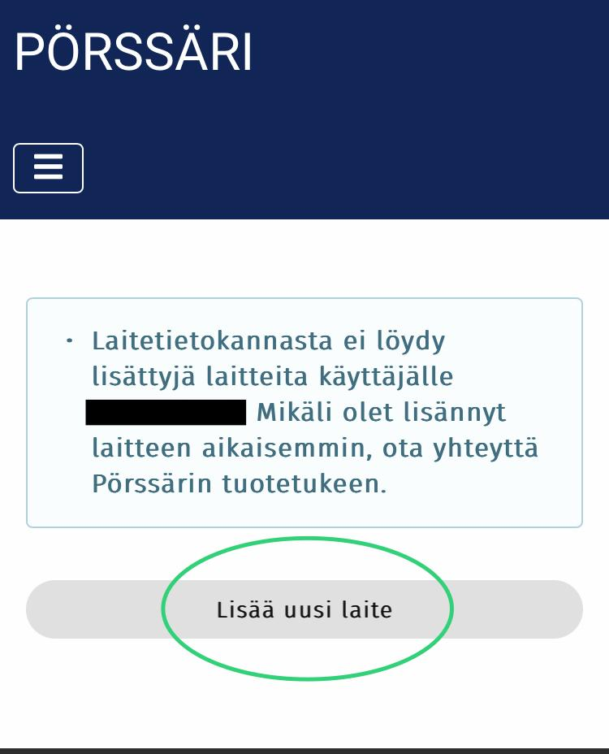

# 2. Siirtyminen uuden laitteen lisäyslomakkeelle

Mikäli sinulla ei ole aiempia lisättyjä laitteita, laitehallinnassa näytetään ilmoitus "Laitetietokannasta ei löydy lisättyjä laitteita..."

Mikäli sinulla on aiemmin lisättyjä laitteita, ne näkyvät laitehallinnassa listattuna laite kerrallaan.

Sivun alareunassa on painike "Lisää uusi laite". Tästä painamalla pääset uuden laitteen lisäyslomakkeelle.

<figure><figcaption></figcaption></figure>

