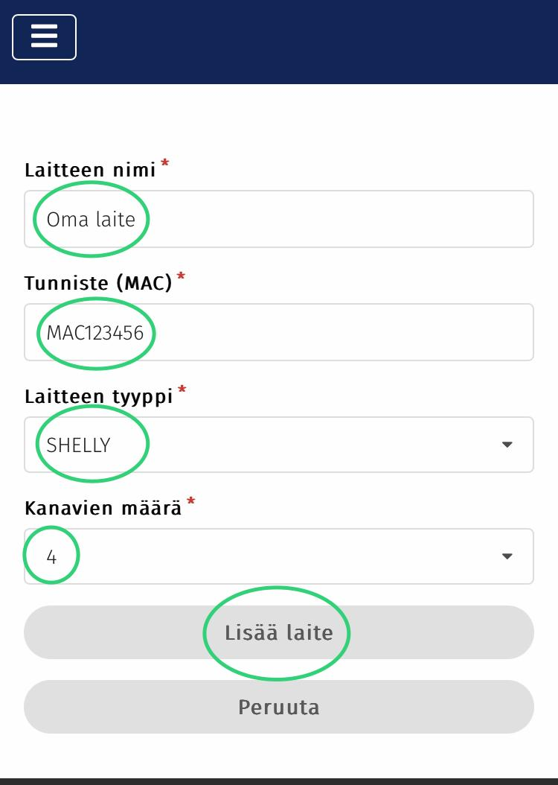

# 3. Uuden laitteen lisäyslomake

Täytä lomakkeeseen laitteesi tiedot.

* Laitteen nimi on valittavissa vapaasti. Ääkkösten ja erikoismerkkien käyttöä ei kuitenkaan tueta.
* Tunnisteeksi laitetaan Shellyn laitetunniste.
* Laitteen tyypiksi valitaan Shelly.
* Kanavamääräksi valitaan ohjattavien kanavien lukumäärä. Pörssäriin kannattaa lisätä kaikki Shellyn kanavat vaikka osaa kanavista käytettäisiin muuten kuin Pörssärin ohjaamana. Pörssäri ei ohjaa sellaisia kanavioa joiden tila asetuksissa on "Ei käytössä".

Lopuksi paina lomakkeen alareunasta "Lisää laite".

<figure><figcaption></figcaption></figure>
