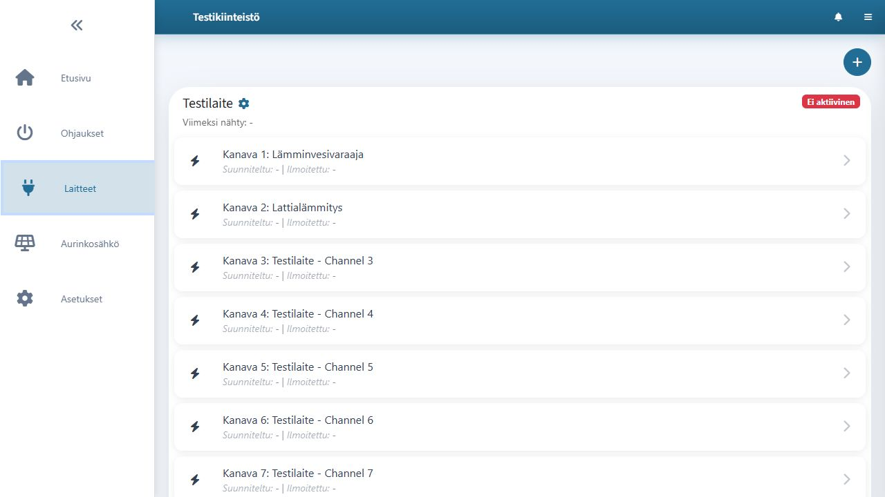

# Laitteiden käyttöönotto

Laitteen lisääminen alkaa sovelluksessa kohdasta **Laitteet → Lisää laite**. Varmista ennen lisäystä, että olet oikealla käyttöpaikalla ja että käyttöpaikalla on rakennus, johon laitekanavien ohjaukset voidaan kohdistaa. Ohjaukset luodaan laitelisäyksen yhteydessä; niitä ei tarvitse tehdä erikseen etukäteen.


[shelly-ohjauksen-lisaeaeminen](shelly-ohjauksen-lisaeaeminen/)



[home-assistant-ohjauksen-lisaeaeminen](home-assistant-ohjauksen-lisaeaeminen/)



[pilvilaitteen-lisaeaeminen.md](pilvilaitteen-lisaeaeminen.md)

