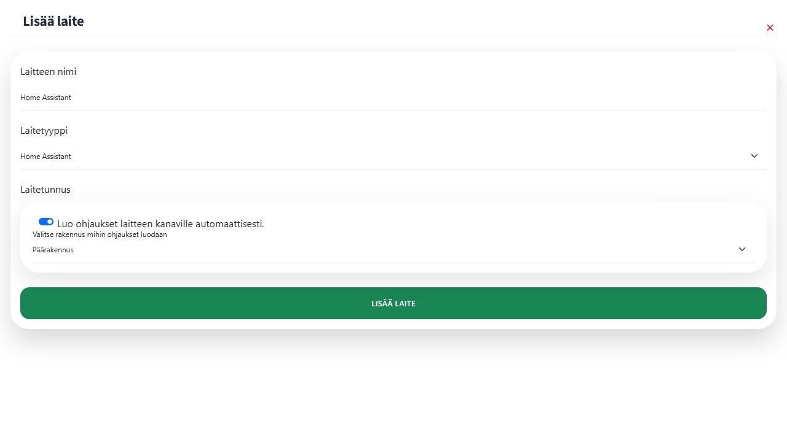

# 1. Lisää Home Assistant -laite

Avaa **Laitteet → Lisää laite → Manuaalinen laite**. Valitse laitetyypiksi **Home Assistant** ja anna laitteelle kuvaava nimi, esimerkiksi **Home Assistant**. Pörssäri muodostaa laitetunnisteen tallennuksen yhteydessä, joten tunnistetta ei kirjoiteta tähän lomakkeeseen.

Pidä **Luo ohjaukset laitteen kanaville automaattisesti** käytössä ja valitse rakennus, esimerkiksi **Päärakennus**.

