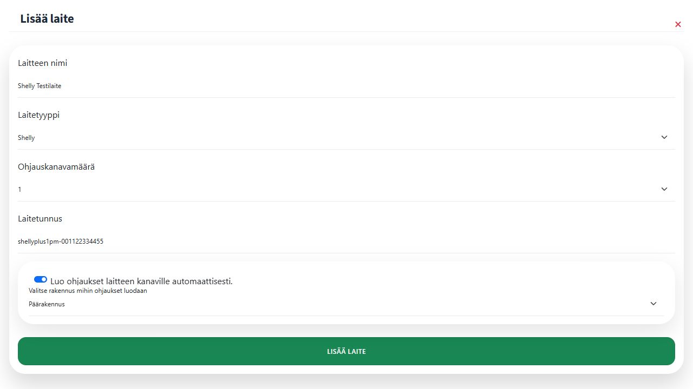

# Shelly-laitteen manuaalinen lisääminen

Manuaalinen lisäys on vaihtoehto adoptiokoodille. Sitä varten tarvitset Shellyn laitetunnisteen ja tiedon käytettävien relekanavien määrästä.

## 1. Tarkista Shellyn laitetunniste

Laitetunnisteen löydät Shelly Smart Control -sovelluksesta laitteen kohdasta **Asetukset → Laitteen tiedot → Device ID**. Gen2- ja Gen3-laitteen paikallisessa rajapinnassa saman tiedon palauttaa `Shelly.GetDeviceInfo`-kutsun `id`-kenttä. Lisätietoa on [Shellyn teknisessä dokumentaatiossa](https://shelly-api-docs.shelly.cloud/gen2/ComponentsAndServices/Shelly/).

Kopioi tunniste sellaisenaan. Älä käytä kentässä laitteen IP-osoitetta tai itse keksittyä nimeä.

## 2. Avaa manuaalinen laitelomake

1. Avaa Pörssärissä oikea käyttöpaikka.
2. Valitse **Laitteet → Lisää laite**.
3. Valitse **Manuaalinen laite**. Vaihtoehdon kuvauksessa mainitaan Shelly, Home Assistant ja mukautettu laite.

## 3. Anna laitteen tiedot

Täytä lomake seuraavasti:

- **Laitteen nimi:** kuvaava nimi, esimerkiksi **Shelly Testilaite**.
- **Laitetyyppi:** **Shelly**.
- **Ohjauskanavamäärä:** valitse Pörssärin ohjaukseen käytettävien relekanavien määrä.
- **Laitetunniste:** Shellystä kopioitu Device ID.
- **Luo ohjaukset laitteen kanaville automaattisesti:** pidä valinta käytössä.
- **Valitse rakennus mihin ohjaukset luodaan:** valitse esimerkiksi **Päärakennus**.

Kuvan laitetunnus on esimerkki. Korvaa se oman Shelly-laitteesi Device ID -tunnisteella.

Valitse lopuksi **Lisää laite**.


Manuaalinen lisäys luo valituille kanaville ohjaukset automaattisesti. Ohjauksia ei luoda erikseen käsin.


## 4. Tarkista laite ja ohjaukset

Tarkista **Laitteet**-näkymästä, että Shelly ja sen kanavat näkyvät. Avaa sitten **Ohjaukset** ja varmista, että kanaville syntyneet ohjaukset ovat valitussa rakennuksessa. Nimeä ohjaukset niiden käyttötarkoituksen mukaan, esimerkiksi **Lämminvesivaraaja** tai **Lattialämmitys**.

Jatka tarvittaessa [Pörssäri-skriptin asennusohjeeseen](ohjausskriptin-lisaeaeminen-shelly-laitteeseen/README.md).
