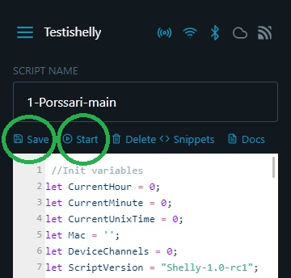

# 4. Ohjausohjelman tallennus ohjelmakirjastosta

Skriptivalikkoon on nyt päivitetty Pörssärin ohjausohjelmakoodit. Sinun tarvitsee lisätä laitteeseen sekä ohjausohjelma että valvontaohjelma.&#x20;


Ohjausohjelma lisätään laitteeseen vain kerran vaikka laitteessa olisi useampia ohjattavia kanavia. Pörssäri ohjaa samalla ohjelmalla kaikkia laitteen kanavia.

On tärkeää lisätä ohjelmat tämän ohjeen mukaisessa järjestyksessä jotta valvontaohjelma toimii oikein.


Paina ohjausohjelman (Porssari main script) alla olevaa painiketta "Insert code". Ohjausohjelma aukeaa muokkausnäkymään. Älä tee mitään muutoksia Pörssärin ohjelmakoodeihin. Tarkoitus on ainoastaan tallentaa ne laitteeseen.

Tallenna ohjausohjelma laitteeseen painamalla "Save". Voit lisäksi jo tässä vaiheessa käynnistää ohjausohjelman painamalla "Start".'

<figure><figcaption></figcaption></figure>
