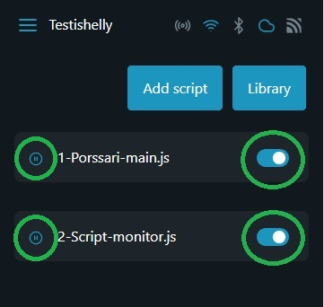

# 6. Ohjelmien aktivointi sekä käynnistäminen

Valvontaohjelman tallentamisen lisäksi palaat takaisin skriptivalikkoon.&#x20;

Mikäli käynnistit skriptit jo tallentamisen yhteydessä sinun tarvitsee vain aktivoida skriptit oikealla olevasta liukusäätimestä. Mikäli et vielä käynnistänyt skriptejä, paina skriptin nimen edessä olevaa "play"-kuvaketta.

Kun olet aktivoinut ohjelmakoodit onnistuneesti, molempien rivien lopussa olevat liukusäätimet näkyvät sinisenä ja ohjelman nimen edessä näkyy käynnissä olevan skriptin merkkinä "pause"-kuvake.

<figure><figcaption></figcaption></figure>
