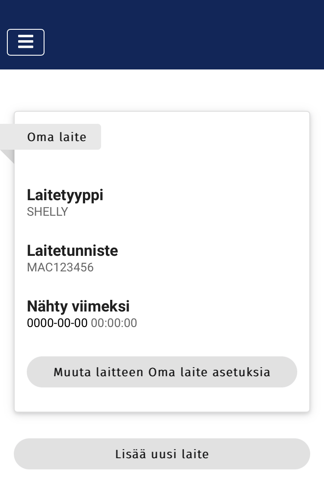

# 4. Valmista tuli!

Saat ilmoituksen onnistuneesta tallennuksesta minkä jälkeen palataan laitehallinta-näkymään. Juuri lisäämäsi laite näkyy nyt laitelistauksessa.&#x20;

Mikäli olet jo ottanut Shelly-skriptin käyttöön laitteessa, päivittyy "Nähty viimeksi" -arvo parin minuutin sisällä aktiivisen yhteyden merkiksi. Huomaathan, että sivu selaimessa on kuitenkin päivitettävä muutoksen näkemiseksi.

Tarvittaessa voit lisätä tilillesi toisen laitteen listauksen alla olevasta "Lisää uusi laite" -painikkeesta.

Ennenkuin siirryt tekemään laitteesi asetuksia, lisää ohjausohjelma Shelly-releeseen ja tarkista, että yhteys Shellyn ja Pörssärin palvelimen välillä toimii (Nähty viimeksi -aikaleima päivittyy). Kun olet todennut yhteyden toimivaksi, voit jatkaa tekemään laitteen asetuksia "Muuta laitteen XXXXX asetuksia" -painikkeesta.

<figure><figcaption></figcaption></figure>
