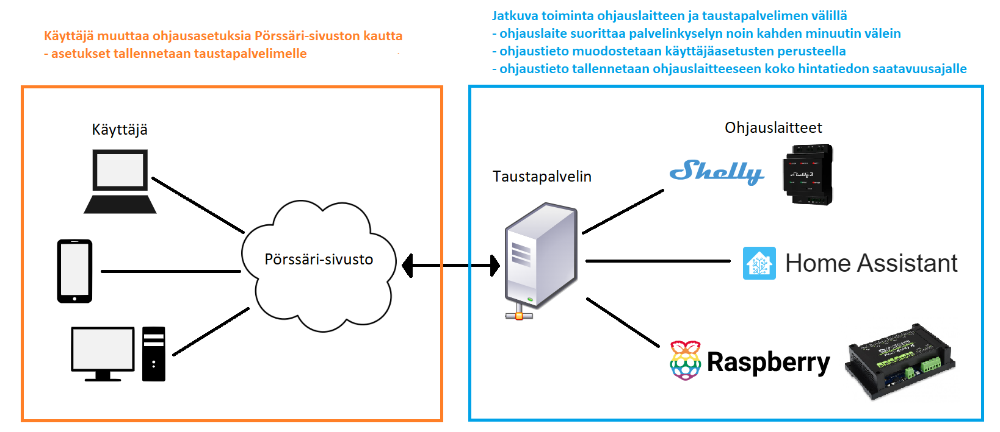

# ❓ Miten Pörssäri toimii?

Pörssäri lähettää asiakaslaitteeseen taustapalvelimelta käyttäjäasetusten perusteella sähkön hintatietojen sekä mahdollisen sääennusteen ja aurinkoennusteen perusteella lasketun päällä/pois -ohjaustiedon

* aina asiakaslaitteen käynnistyessä
* kun käyttäjäasetuksia muutetaan
* mikäli edellisestä ohjaustiedon lähettämisestä on kulunut yli tunti aikaa.&#x20;

Erona tavanomaisiin pilvipalveluihin tai muihin Shellyn ohjausskripteihin verrattuna Pörssäri ei vaadi jatkuvaa internet-yhteyttä. Ihannetilanteessa ohjaustietoa tallennetaan vastaanottavaan laitteeseen noin 30h eteenpäin kun seuraavan päivän hintatiedot on NordPoolin toimesta julkaistu.

Käyttäjäasetuksia voidaan muuttaa mistä tahansa sijainnista internet-yhteyden välityksellä. Pörssärin kautta ei kuitenkaan ole pääsyä käyttäjän kotiverkkoon, sillä ohjaustieto palautetaan vastauksena ohjauslaitteen suorittamaa kyselyyn. Pörssäri ei tarvitse toimiakseen Shellyn Cloud -ominaisuutta, mutta sen käytölle ei myöskään ole mitään estettä.

<figure><figcaption></figcaption></figure>

Pörssärin etuna on helppokäyttöinen asetusten muokkaus. Käyttäjän ei tarvitse tehdä muutoksia  Pörssärin Shelly-ohjelmakirjaston kautta haettuun valmiiseen ohjelmakoodiin. Lisäksi asetukset ovat tallessa taustapalvelimella mikäli ohjausohjelmaa tarvitsee päivittää tai se syystä tai toisesta vioittuu ja joudutaan vaihtamaan uuteen. Mikäli käytössä olisi skriptiohjaus missä asetukset on tallennettuna skriptin joukkoon, tulisi nämä päivityksen yhteydessä aina tehdä uudelleen.
