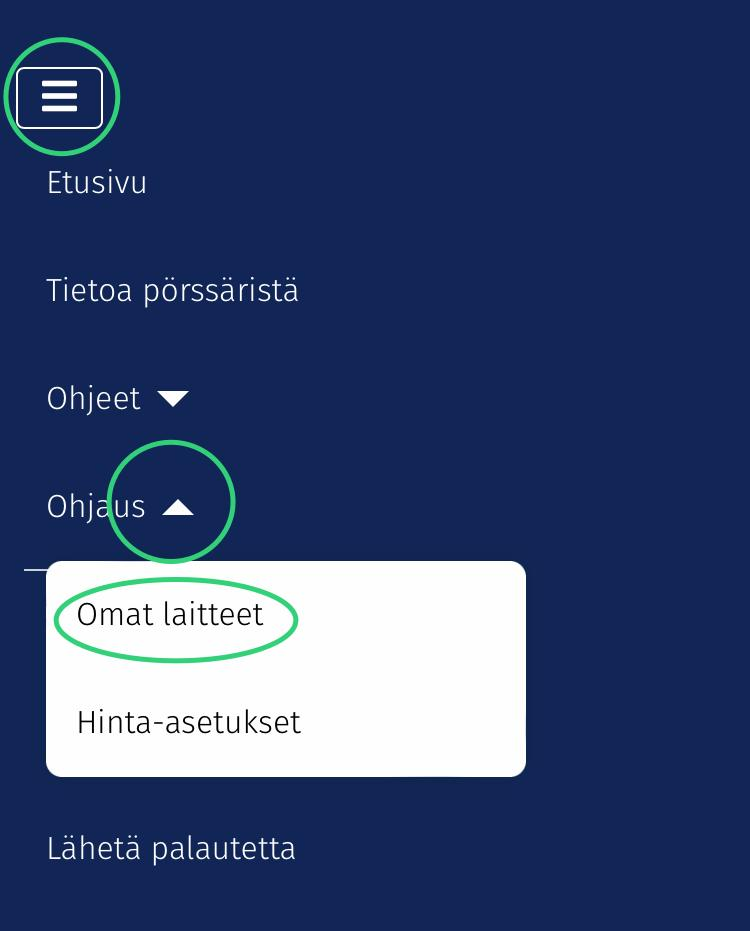

# 1. Siirtyminen laitehallintaan

Siirry Pörssäri-sivuston laitehallintaan valitsemalla valikosta "Ohjaus - Omat laitteet" tai vaihtoehtoisesti siirry sivulle "Ohjaus" ja valitse sivun alusta "Siirry laitehallintaan".

<figure><figcaption></figcaption></figure>
