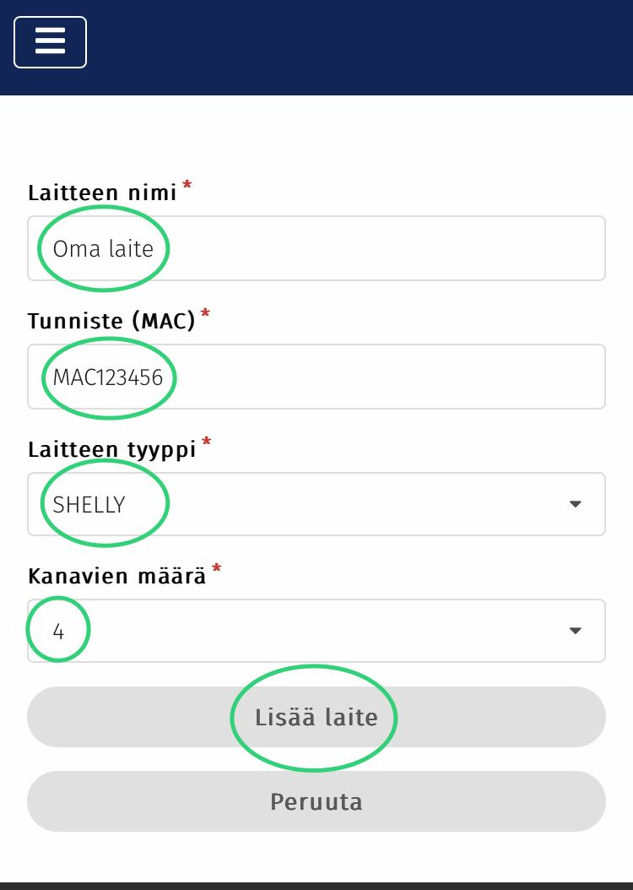

# 3. Uuden laitteen lisäyslomake

Täytä lomakkeeseen laitteesi tiedot.

* Laitteen nimi on valittavissa vapaasti. Ääkkösten ja erikoismerkkien käyttöä ei kuitenkaan tueta.
* Tunnisteeksi laitetaan Shellyn laitetunniste (Device Id). Tunnus tulee syöttää sivustolle numeroita ja isoja kirjaimia käyttäen huolimatta siitä, että Shelly Smart Control -sovelluksessa kirjaimet on pienellä.
  * Laitetunniste löytyy joko Shellyn web-käyttöliittymän alareunasta tai vaihtoehtoisesti Shelly Smart Control -sovelluksesta menemällä kyseisen Shellyn asetusvalikkoon ja valitsemalla sieltä "Device information".
* Laitteen tyypiksi valitaan Shelly.
* Kanavamääräksi valitaan ohjattavien kanavien lukumäärä. Pörssäriin kannattaa lisätä kaikki Shellyn kanavat vaikka osaa kanavista käytettäisiin muuten kuin Pörssärin ohjaamana. Pörssäri ei ohjaa sellaisia kanavioa joiden tila asetuksissa on "Ei käytössä".

Lopuksi paina lomakkeen alareunasta "Lisää laite".

<figure><figcaption></figcaption></figure>
