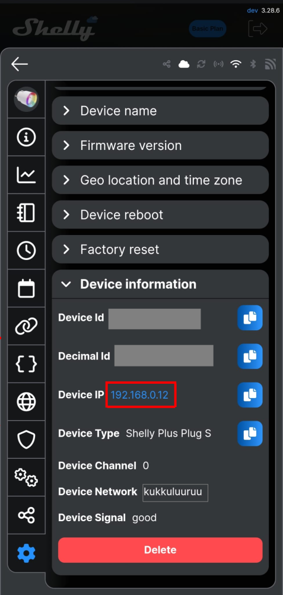
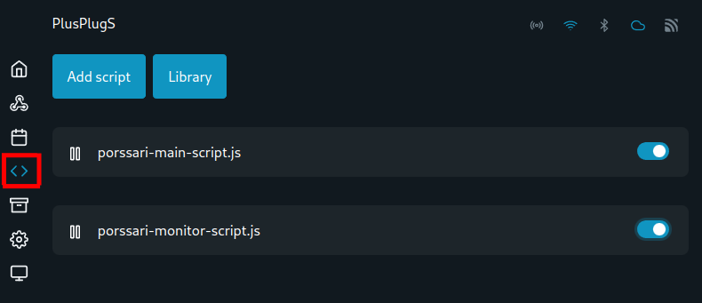
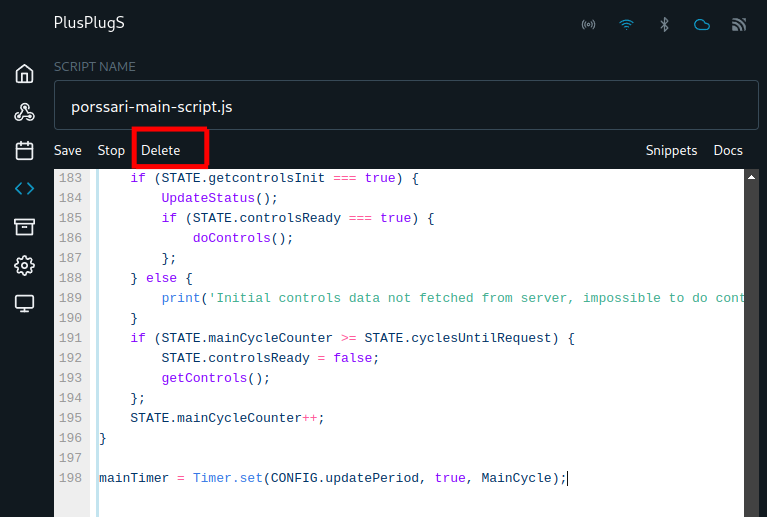

# 1. Vanhan skriptin poistaminen

Mene joko mobiililaitteen tai tietokoneen web-selaimella Shelly-laitteesi ohjausliittymään kirjoittamalla osoitteeksi Shelly-releesi ip-osoite. Osoitteen löydät helpoiten Shelly Smart Control –puhelinsovelluksesta laitteen asetuksista. Huomaa, että päästäksesi asetusliittymään laitteen täytyy olla samassa wifi-verkossa Shelly-releen kanssa.

<figure><figcaption></figcaption></figure>

Päästyäsi laitteen asetusliittymään avaa laitteen asetusvalikko ja valitse sieltä vaihtoehto "< > Scripts".

<figure><figcaption></figcaption></figure>

Avaa molemmat skriptit yksi kerrallaan klikkaamalla skriptin nimestä, ja poista ne valitsemalla avautuvasta muokkausnäkymästä "Delete". Kun molemmat skriptit on poistettu, voit jatkaa eteenpäin.

<figure><figcaption></figcaption></figure>
