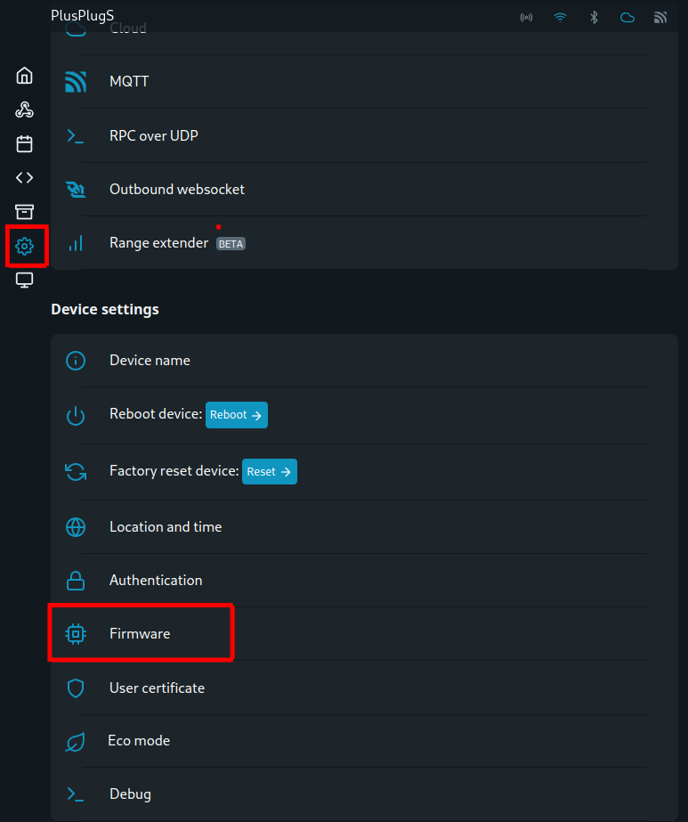

# 2. Shellyn laiteohjelmiston päivitys

Kun olet poistanut molemmat skriptit, siirry vasemman reunan valikosta osioon "Settings" ja etsi sieltä kohta "Firmware". Avaa kyseinen valikko, ja mikäli Shelly tarjoaa laiteohjelmiston päivitystä, asenna uusin laiteohjelmisto.

Mikäli saat avautuvassa päivitysikkunassa ilmoituksen _"You are using X.X.X (latest) version of the firmware. **Check again."**_ ei laiteohjelmistoa tarvitse päivittää.

Mikäli laiteohjelmistoa ei tarvitse päivittää, käynnistä Shelly uudelleen valitsemalla edellisestä asetusvalikosta "Reboot device".

<figure><figcaption></figcaption></figure>
