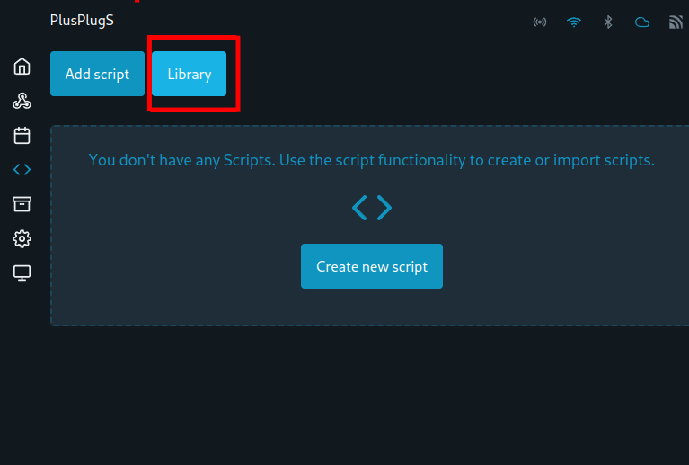
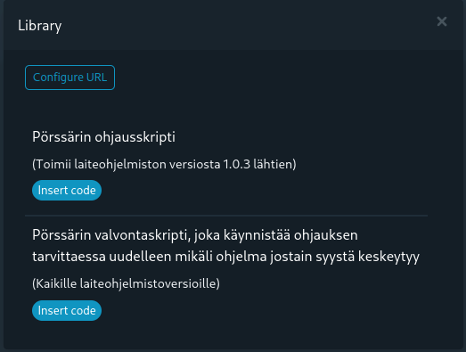

# 3. Ohjelmakirjaston avaaminen

Uudelleenkäynnistyksen jälkeen siirry takaisin skriptivalikkoon mistä aikaisemmin poistettiin vanhat ohjausskriptit. Avaa skriptisivun yläreunasta "Library".

<figure><figcaption></figcaption></figure>


Mikäli sinulle aukeaa Shellyn ohjelmakirjasto tai sinulla on ollut aikaisemmin käytössä Pörssärin vanha ohjelmakirjasto, täytyy kirjaston osoite päivittää. Valitse "Configure URL" ja liitä avautuvaan osoitekenttään seuraava osoite:

[https://raw.githubusercontent.com/Porssari/Shelly-client/main/release/porssari-manifest.json](https://raw.githubusercontent.com/Porssari/Shelly-client/main/release/porssari-manifest.json)


Skriptikirjaston osoitteen tallentamisen jälkeen sinulla pitäisi olla edessäsi seuraavanlainen näkymä.

<figure><figcaption></figcaption></figure>
