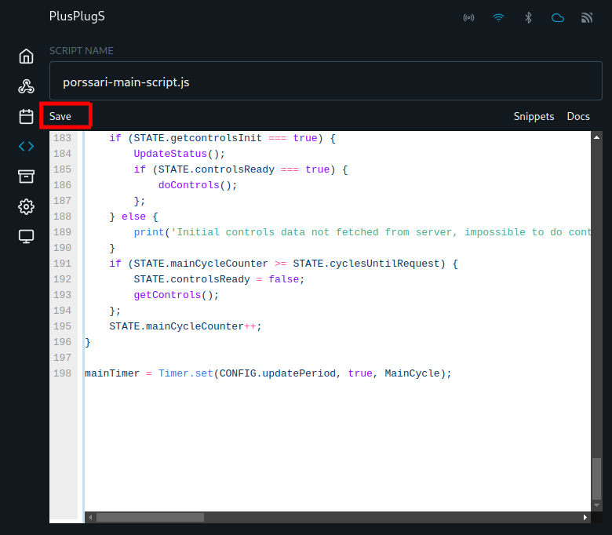

# 4. Uuden ohjausskriptin lisääminen

Lisää ensin “Pörssärin ohjausskripti” painamalla kirjastosta “Insert Code”.&#x20;

Tallenna skripti avautuvasta ikkunasta painamalla “Save”.

Tämän jälkeen palaa takaisin skriptivalikkoon vasemman reunan valikosta (<> Scripts), ja tee sama toimenpide valvontaskriptille (Insert Code --> Save). Valvontaskriptin oikean toiminnan takaamiseksi on tärkeää lisätä skriptit tässä järjestyksessä.

Kun olet saanut myös valvontaskriptin tallennettua, palaa takaisin skriptivalikkoon vasemman reunan valikosta (<> Scripts).

<figure><figcaption></figcaption></figure>
