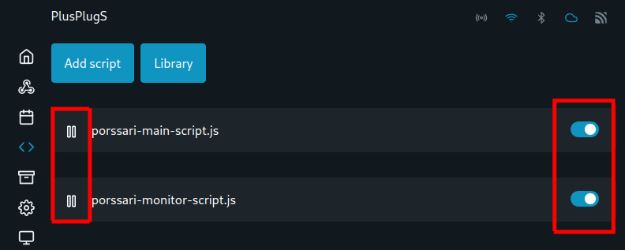

# 5. Käynnistä ja aktivoi skriptit

Käynnistä ja aktivoi molemmat skriptit skriptivalikosta.&#x20;

Käynnistäminen ("play-kuvake") käynnistää skriptit heti minkä jälkeen skriptin edessä oleva "play-kuvake" vaihtuu "pause-kuvakkeeksi.&#x20;

Aktivoiminen (oikean puoleinen nappi) asettaa skriptin käynnistymään automaattisesti Shellyn käynnistyessä uudelleen.&#x20;

Kun olet käynnistänyt ja aktivoinut skriptit, valikon pitäisi näyttää tältä:

<figure><figcaption></figcaption></figure>
