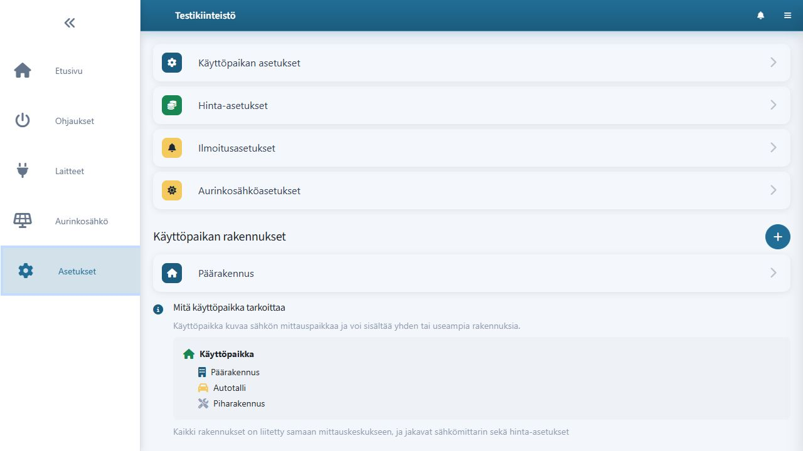
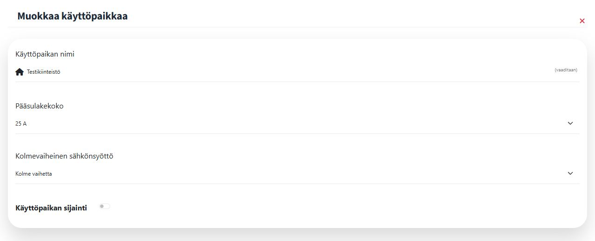
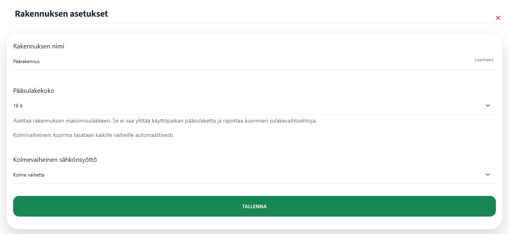
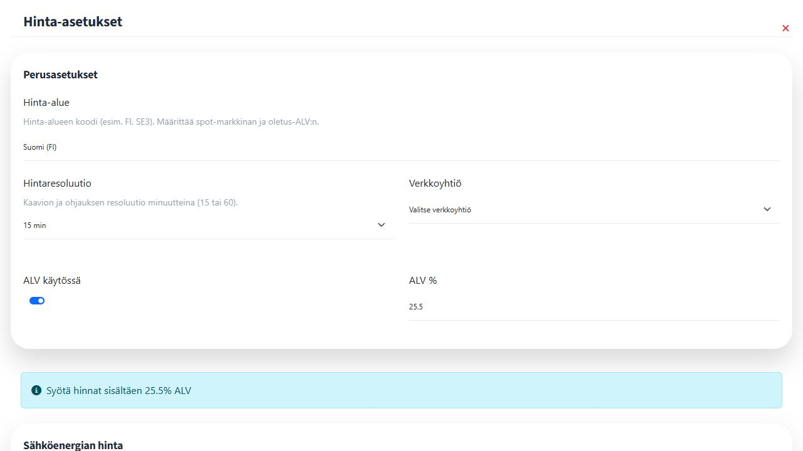

# Käyttöpaikan lisääminen ja asetukset

Avaa käyttäjävalikko ja valitse **Käyttöpaikat**-osiosta **Lisää käyttöpaikka**. Luo käyttöpaikka, esimerkiksi **Testikiinteistö**. Pörssäri ottaa uuden käyttöpaikan käyttöön ja luo sille automaattisesti rakennuksen nimeltä **Päärakennus**.

Avaa tämän jälkeen **Asetukset**. Anna käyttöpaikan asetuksiin ohjausten tarvitsemat tiedot. Jos käytät sää- tai aurinkoennustetta, lisää sijaintitiedot asetuksissa vain siinä laajuudessa kuin palvelu pyytää.

Käyttöpaikan asetuksissa määritetään nimi, pääsulakekoko ja käytettävissä olevat vaiheet. Esimerkissä Testikiinteistöllä on 25 A:n kolmivaiheinen sähkösyöttö.

Lisää Asetuksissa muita rakennuksia vain tarvittaessa, esimerkiksi **Autotalli**. Rakennukset erottavat kohteet, joissa ohjaukset sijaitsevat. Laitteen käyttöönotossa syntyvät ohjaukset kohdistetaan oikeaan rakennukseen.

Hinta- ja siirtohinta-asetukset löytyvät samasta **Asetukset**-näkymästä. Lisää oma marginaali, sähkövero ja vaihtuvan siirtotariffin tiedot, jos haluat ohjausten vertaavan sähkön kokonaishintaa. Kiinteällä siirtotariffilla erillisiä siirtoaikoja ei yleensä tarvitse määrittää.

Aurinkosähköjärjestelmät lisätään Asetuksissa käyttöpaikalle. Lisää kukin paneelikenttä omana järjestelmänään, jos niiden suuntaus tai kaltevuus poikkeaa toisistaan.
