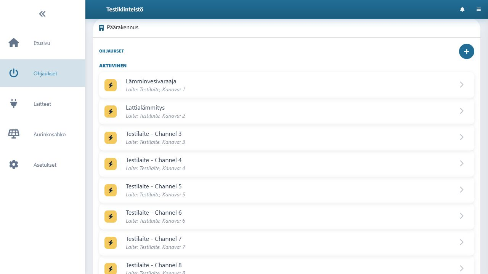
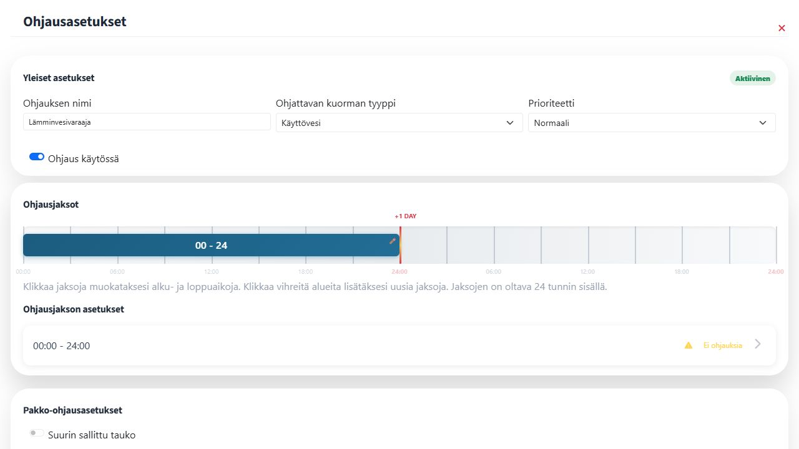

# Ohjaukset ja ohjausasetukset

Shellyä, Home Assistantia tai mukautettua laitetta lisättäessä valinta **Luo ohjaukset laitteen kanaville automaattisesti** luo laitteen kanaville ohjaukset valittuun rakennukseen. Shelly lisätään manuaalisena laitteena 12-merkkisellä Device ID:llä ilman mallinimeä. Pilvilaitteen tuonnissa rakennus valitaan laitekohtaisesti. Avaa sovelluksen **Ohjaukset** ja valitse esimerkiksi Päärakennuksen **Lämminvesivaraaja**.

Valitun ohjauksen **Ohjausasetukset**-näkymässä määritetään ohjaustapa ja sen tarvitsemat arvot, kuten käyttöaika, tuntimäärä, hintaraja tai lämmitykseen liittyvät asetukset. Tallenna muutokset ja tarkista, että ohjaus näkyy ohjausten listalla oikeassa rakennuksessa.

Lisää laite ennen ohjausta. Tarkista laitelisäyksen jälkeen **Ohjaukset**-näkymästä, että laitteen kanaville syntyneet ohjaukset ovat oikeassa rakennuksessa.
