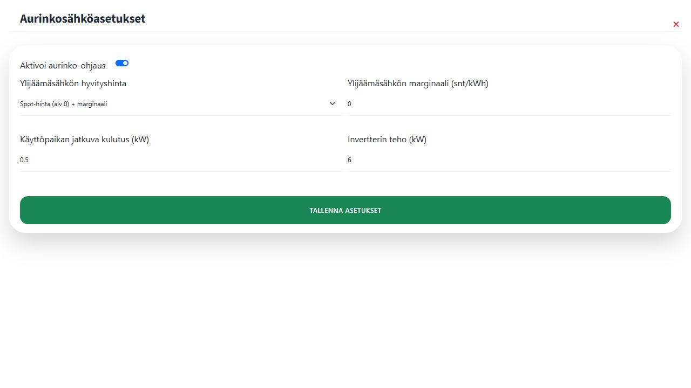

# 1. Aurinkovoimalan lisääminen

Avaa ensin **Asetukset → Aurinkosähköasetukset**. Aktivoi aurinko-ohjaus ja määritä vähintään käyttöpaikan jatkuva kulutus sekä muut oman sopimuksesi ja laitteistosi tarvitsemat asetukset. Käyttöpaikan sijaintitiedot on asetettava, jotta aurinkoennustetta voidaan käyttää.

**Käyttöpaikan jatkuva kulutus (kW)** tarkoittaa kulutusta, jota syntyy ympäri vuorokauden. Arvo auttaa arvioimaan, kuinka paljon aurinkotuotannosta jää ohjattaville laitteille. Määritä lisäksi invertterin koko ja ylijäämäsähkön hyvityshinta lomakkeen mukaisesti.

Kuvan arvot ovat esimerkkejä. Käytä oman sähkösopimuksesi ja aurinkosähköjärjestelmäsi tietoja.

Tallenna asetukset, avaa päävalikosta **Aurinkosähkö** ja valitse **Lisää aurinkovoimala**. Käyttöpaikalle voi lisätä useita aurinkovoimaloita. Lisää eri ilmansuuntiin tai eri kaltevuuksiin asennetut paneelikentät erillisinä voimaloina, jotta ennuste voidaan laskea tarkemmin.
