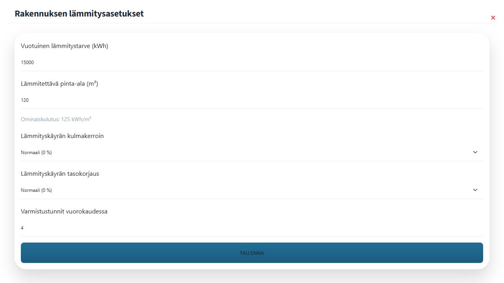
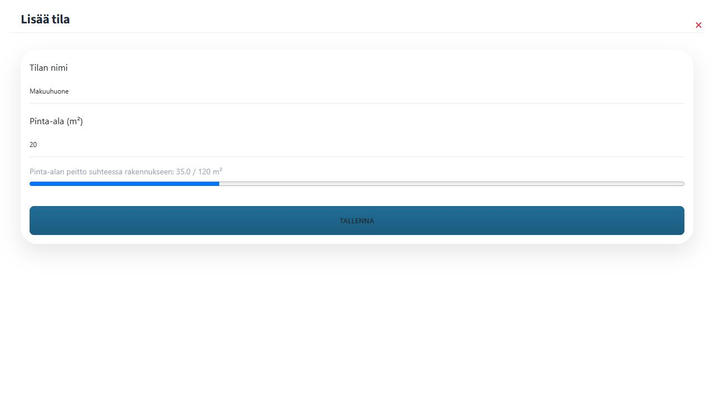

# 1. Rakennuksen lämmitysasetukset ja tilat

Lisää ensin käyttöpaikka, rakennus ja lämmitystä ohjaava laite aloitusohjeiden mukaan. Varmista **Asetukset**-näkymässä, että käyttöpaikan sijaintitiedot ovat oikein sääennustetta varten.

1. Avaa päävalikosta **Ohjaukset**.
2. Etsi oikean rakennuksen, esimerkiksi **Päärakennuksen**, kortti.
3. Avaa kortin **Lämmitysasetukset**-osiosta **Rakennuksen lämmitysasetukset**.
4. Anna rakennuksen **Vuotuinen lämmitystarve (kWh)** ja **Lämmitettävä pinta-ala (m²)**.
5. Tarkista **Lämmityskäyrän kulmakerroin**, **Lämmityskäyrän tasokorjaus** ja **Varmistustunnit vuorokaudessa**. Oletusarvoja voi muuttaa myöhemmin kokemusten perusteella.
6. Tallenna asetukset.

## Lisää lämmitettävät tilat

Rakennuksen lämmitysasetusten alaosassa on **Rakennuksen tilat** -osio.

1. Valitse pluspainike **Lisää tila**.
2. Anna tilan nimi ja pinta-ala, esimerkiksi **Olohuone**, 35 m².
3. Tallenna tila ja lisää samalla tavalla muut lämmitettävät tilat.

Pörssäri näyttää lisättyjen tilojen yhteenlasketun pinta-alan suhteessa rakennuksen lämmitettävään pinta-alaan. Lämmitysjärjestelmää ei voi lisätä ennen kuin vuotuinen lämmitystarve, lämmitettävä pinta-ala ja vähintään yksi tila on tallennettu.
