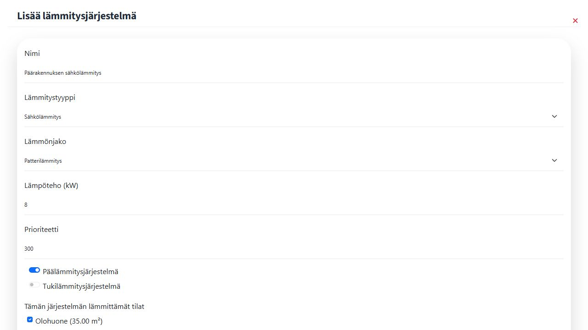
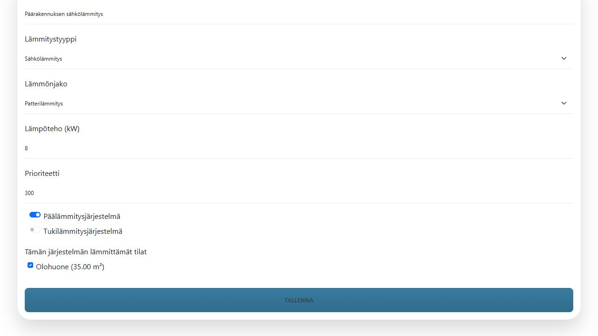

# 2. Lämmitysjärjestelmän lisääminen

Kun rakennuksen lämmitysasetukset ja vähintään yksi tila on tallennettu, palaa **Ohjaukset**-näkymään. Rakennuksen **Lämmitysasetukset**-osiossa näkyy nyt pluspainike **Lisää lämmitysjärjestelmä**.

1. Avaa **Lisää lämmitysjärjestelmä**.
2. Anna järjestelmälle kuvaava nimi, esimerkiksi **Päärakennuksen sähkölämmitys**.
3. Valitse **Lämmitystyyppi** ja **Lämmönjako**.
4. Anna järjestelmän **Lämpöteho (kW)** ja tarvittaessa muuta prioriteettia.
5. Valitse, onko kyseessä **Päälämmitysjärjestelmä** tai **Tukilämmitysjärjestelmä**.
6. Valitse kaikki tilat, joita järjestelmä lämmittää. Uudelle järjestelmälle on valittava vähintään yksi tila.
7. Tallenna.

Valitse lämmitettävät tilat ja lopuksi **Tallenna**.

Tallennus luo lämmitysjärjestelmän. Älä luo sille uutta laitetta tai ylimääräistä ohjausta. Seuraavassa vaiheessa järjestelmään liitetään laitteelle jo olemassa oleva ohjauskanava **Ohjaimet**-toiminnolla.


Jos pluspainiketta ei näy, avaa **Rakennuksen lämmitysasetukset** ja tarkista, että vuotuinen lämmitystarve ja lämmitettävä pinta-ala ovat nollaa suurempia ja rakennuksella on vähintään yksi tila.

