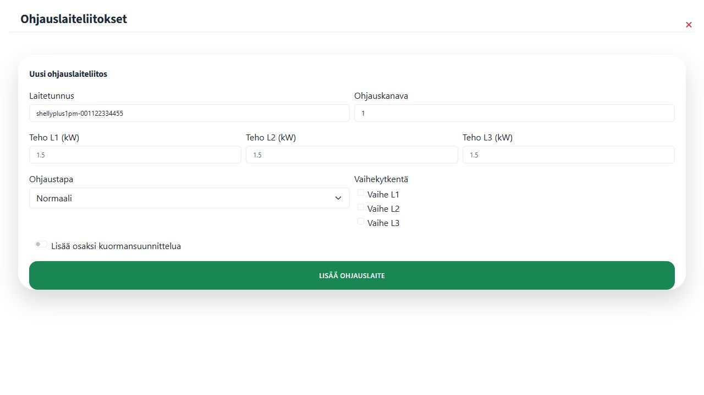
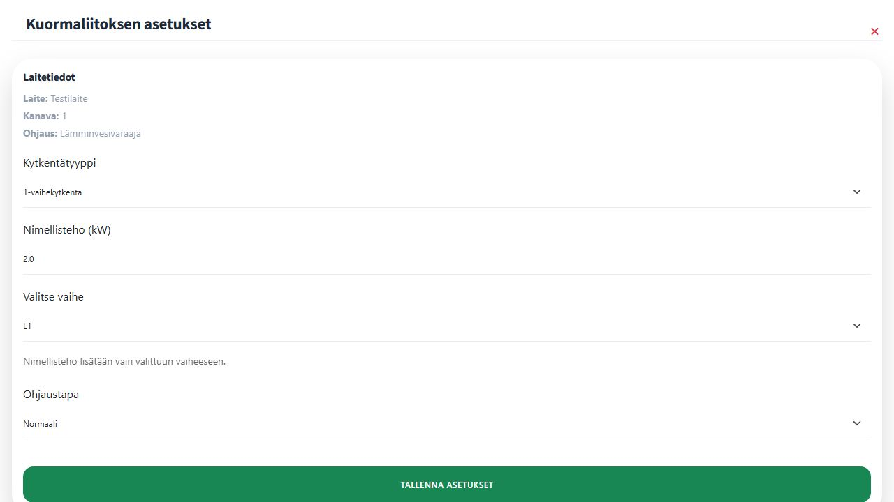

# 3. Ohjaimet ja laitekanavan asetukset

Lämmitysjärjestelmä tarvitsee sitä fyysisesti ohjaavan laitekanavan.

1. Avaa **Ohjaukset** ja etsi rakennuksen **Lämmitysasetukset**-osiosta tallentamasi lämmitysjärjestelmä.
2. Valitse järjestelmän vierestä **Ohjaimet**.
3. Anna Pörssäriin jo lisätyn laitteen **Laitetunnus** ja oikea **Ohjauskanava**.
4. Valitse **Lisää ohjauslaite**.

Kuvan laitetunnus on esimerkki. Käytä oman, Pörssäriin jo lisätyn laitteesi tunnusta. Shellyllä se on 12-merkkinen Device ID ilman mallinimeä. Määritä pysyvät teho-, vaihe- ja ohjaustapa-asetukset tämän sivun seuraavassa **Laitteet**-näkymän vaiheessa. Ohjainliitoslomakkeessa näkyvät muut asetukset eivät korvaa laitekanavan asetuksia.

Tallennettu liitos näkyy saman näkymän **Liitetyt ohjaimet** -taulukossa. Liitos yhdistää olemassa olevan laitekanavan lämmitysjärjestelmään; se ei luo uutta laitetta tai ylimääräistä ohjausta.

## Määritä kanavan teho ja vaiheistus

1. Avaa **Laitteet** ja etsi järjestelmään liitetty laite, esimerkiksi **Testilaite**.
2. Avaa järjestelmään liitetty kanava.
3. Valitse **Kytkentätyyppi**: ei asetettu, yksi-, kaksi- tai kolmivaiheinen.
4. Anna kuorman **Nimellisteho (kW)**.
5. Valitse yksi- tai kaksivaiheisen kuorman käyttämä vaihe tai vaiheyhdistelmä. Kolmivaiheisen kuorman teho jaetaan tasan kaikille vaiheille.
6. Valitse **Ohjaustavaksi** **Normaali** tai **Käänteinen**.
7. Jos kyseessä on lämpötilan ohjausta tukeva virtuaalilaite, tarkista myös päälle- ja poislämpötilat.
8. Valitse **Tallenna asetukset**.


Varmista vaiheistus ja tehoarvot sähköasennuksen tiedoista. Virheelliset arvot voivat vääristää tehonrajoitusta ja kuormantasausta.

