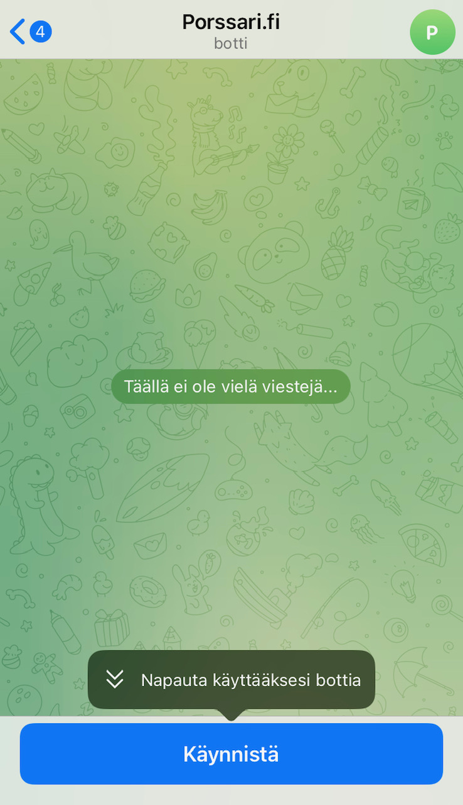

# 1. Yhteysvahdin avaaminen Telegram-sovellukseen

Siirry mobiililaitteesi web-selaimella osoitteeseen [https://t.me/porssari\_fi\_bot](https://t.me/porssari\_fi\_bot).

Mikäli laitteessasi ei ole vielä Telegram-sovellusta asennettuna, voit siirtyä mobiililaitteesi sovelluskauppaan valitsemalla "Download". Kun olet saanut asennettua Telegram-sovelluksen, siirry uudelleen web-selaimella edellä olevan linkin osoitteeseen.

Mikäli sinulla on jo Telegram-viestisovellus puhelimessasi asennettuna, valitse sivulla olevasta painikkeesta "Send message" minkä jälkeen sinulta kysytään vielä vahvistus "Avataanko Telegram-apissa". Vastaa tähän "Avaa" minkä jälkeen siirryt Telegram-sovellukseen seuraavanlaiseen näkymään.

<figure><figcaption></figcaption></figure>
